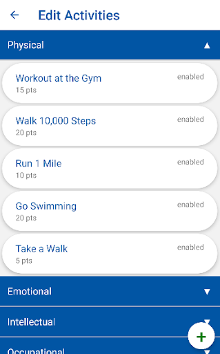

# VBA Wellness Application

## Introduction

The VBA Wellness Application creates a competitive environment that encourages young lawyers to maintain a healthier lifestyle through healthy competitions.

## Client Application

### Installation and Build Instructions

#### IOS

_The IOS instructions assume you have XCODE, XCODE Command Line Tools, and the XCODE simulator installed._

1. Clone the repository
2. Navigate to `Client` directory and run `npm install`
3. Navigate to `ios` directory and run `pod install`
4. Build the appliction:
   1. In `Client` run `react-native start`
   2. Then build the application using `react-native run-ios`

If simulator keeps refreshing at this point try rerunning Metro with `react-native start --reset-cache`

#### Android
_The Android instructions assume you have an Android Virtual Device installed and setup, instructions for this can be found [here](https://reactnative.dev/docs/environment-setup)_

1. Clone the repository
2. Navigate to `Client` directory and run `npm install`
3. Then run `npx react-native run-android` to start the Metro bundler, and build the app
4. The emulator will then open in a new window and load the app

### Sample Screens

